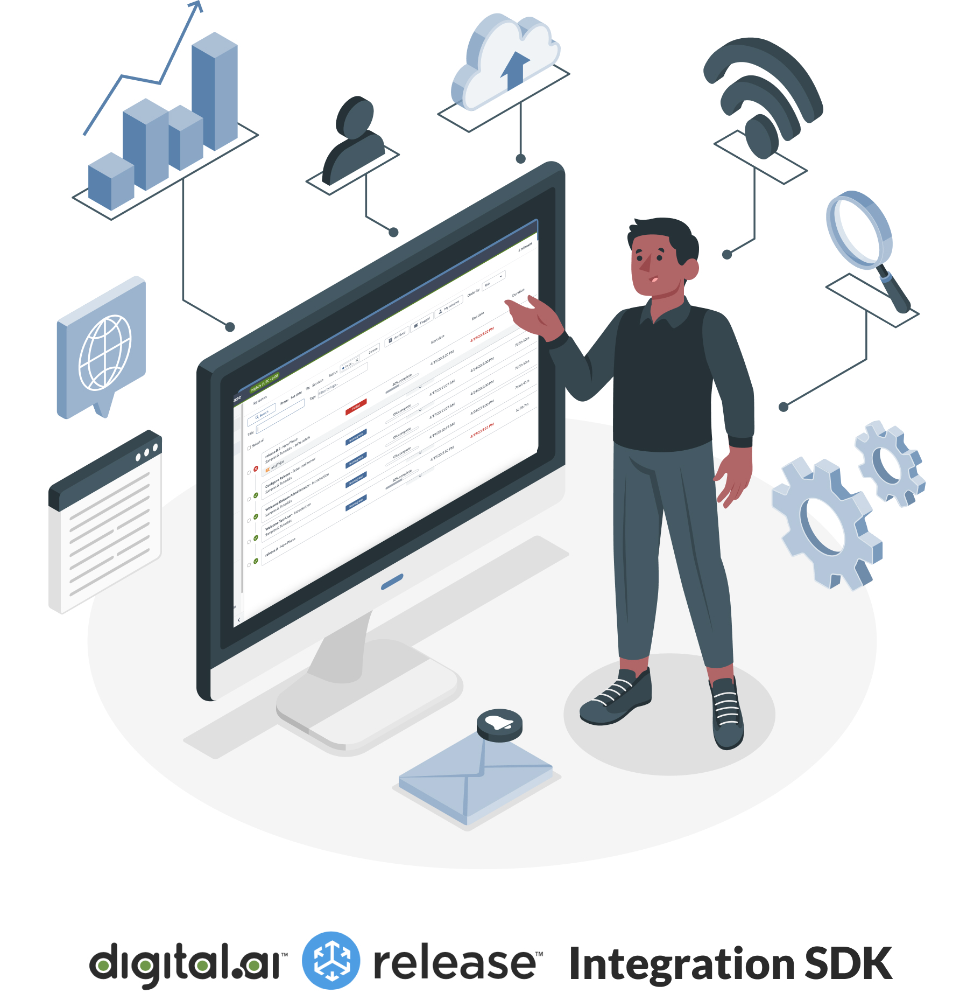

# Hands-on Workshop

To make your job easier, we are bringing a new integration SDK experience.

Run tasks as containers, using any language or third-party library.

In this workshop, you will learn how to

* Build and maintain custom integrations using Python 3
* Set up a development environment for building, testing, installing, and running integration tasks
* Configure a production-style architecture to run the container-based tasks in a Kubernetes cluster

## System requirements

You will run this workshop on your own machine. Here's a breakdown of the components that you need to have.

* **Operating system**: Windows, Linux, macOS. For Macs with the M1/M2 chip, macOS Ventura is required and enable Rosetta in Docker Desktop under 'Feature in development'
* **Internal memory**: Enough to run Docker comfortably, 8 GB min; 16 GB recommended
* **GitHub** account
* **Docker Desktop**, latest version
* **Admin privileges** on your system. You need to be able to edit the `/etc/hosts` file
* **Python 3.11**
* **Code editor or IDE** like PyCharm or Visual Code

### Requirements for part 3: Production Setup with Kubernetes (optional)

Container-based integration plugins are meant to run on a Kubernetes cluster. To have a hands-on experience you will need to install additional components.

⚡️ **Note:** Some Kubernetes experience is needed to make the best of this exercise. Feel free to skip this part if Kubernetes is all new to you (or be prepared for a steep learning curve)

Refer to [Part 3](part-3/lab-6-prepare-for-kubernetes.md) for a detailed list of requirements regarding the Kubernetes setup.

## Help needed?

If you get stuck during the workshop, check the [Troubleshooting section](troubleshooting.md) for common problems

For further questions or remarks, use our public Slack channel [#release-sdk-workshop](https://u.digital.ai/4dx4f4s).

## Workshop Contents

### Introduction

* [PowerPoint presentation](https://github.com/digital-ai/release-integration-sdk-workshop/raw/main/resources/Digitalai-Release-SDK-Introduction.pptx)

[Watch the recording of the Introduction](https://digitalai.wistia.com/medias/6orhkhx1n8)

### Part 1 - Getting started

* [Lab 0 - Getting Started: Check out and run Release](part-1/lab-0-checkout-project-and-run-release.md)
* [Lab 1 - Run Hello World](part-1/lab-1-run-hello-world.md)
* [Lab 2 - Create a project repository](part-1/lab-2-create-project-repository.md)
* [Lab 3 - Set up Python and IDE](part-1/lab-3-setup-python-and-ide.md)
* [Lab 4 - Define a new task and test](part-1/lab-4-define-a-new-task-and-test.md)

[Watch the recording of Part 1](https://digitalai.wistia.com/medias/84bua0bspj)

### Part 2 - Create your own task

* [Lab 5 - Create integration to a third party server](part-2/lab-5-create-a-third-party-integration.md)

### Part 3 - Production Setup with Kubernetes

* [Lab 6 - Prepare Kubernetes](part-3/lab-6-prepare-for-kubernetes.md)
* [Lab 7 - Install Remote Runner](part-3/lab-7-install-remote-runner.md)

---

[Start](part-1/lab-0-checkout-project-and-run-release.md)
