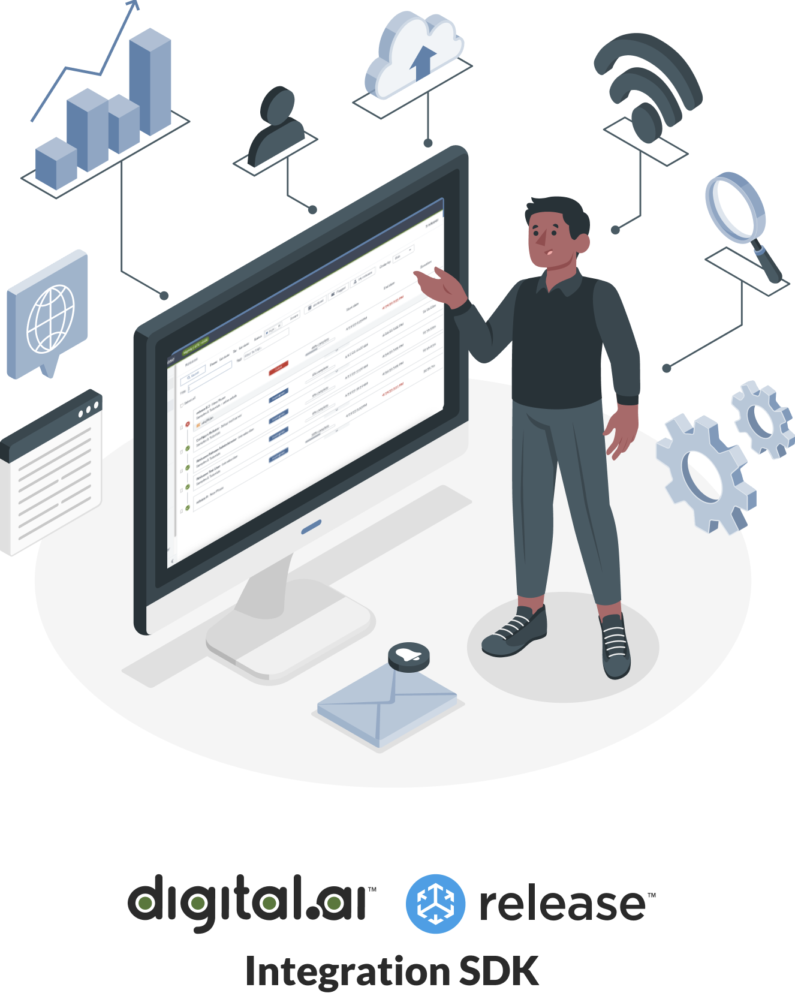

# Hands-on Workshop

To make your job easier, we are bringing a new integration SDK experience.

Run tasks as containers, using any language or third-party library.

In this workshop, you will learn how to

* Build and maintain custom integrations using Python 3
* Set up a development environment for building, testing, installing, and running integration tasks
* Configure a production-style architecture to run the container-based tasks in a Kubernetes cluster

## Workshop prerequisites

You will run this workshop on your own machine. You will need to have the following installed

### Bare minimum

To run the HelloWorld example and do a few minor modifications to the example, you only need

* A git client
* Docker
* Admin privileges on your system

This is all to get started!

The template project to get you started provides build scripts and a development environment that will launch Digital.ai Release with a temporary license.

### Development exercises

To start developing the integrations plugins, install the following

* [Python3](https://www.python.org/downloads), version 3.11
* The `pip` installer tool (bundled with Python)
* A code editor or IDE like VisualCode or PyCharm/IntelliJ

### Production setup (optional)

Container-based integration plugins are meant to run on a Kubernetes cluster. To have a hands-on experience you will need the following components.

⚡️ **Note:** Some Kubernetes experience is needed to make the best of this exercise. Feel free to skip this part if Kubernetes is all new to you (or be prepared for a steep learning curve)

Refer to [Part 3](part-3/lab-6-prepare-for-kubernetes.md) for a detailed list of requirements regarding the Kubernetes setup.

## Workshop Contents

💡 **Note:** If you get stuck during the workshop, check the [Troubleshooting section](troubleshooting.md) for common problems

### Introduction
* Presentation sketching out the container-based architecture and what we are going to do in the workshop

### [Part 1 - Getting started](part-1/)

* [Lab 0 - Getting Started: Check out and run Release](part-1/lab-0-checkout-project-and-run-release.md)
* [Lab 1 - Run Hello World](part-1/lab-1-run-hello-world.md)
* [Lab 2 - Create a project repository](part-1/lab-2-create-project-repository.md)
* [Lab 3 - Set up Python and IDE](part-1/lab-3-setup-python-and-ide.md)
* [Lab 4 - Define a new task and test](part-1/lab-4-define-a-new-task-and-test.md)

### [Part 2 - Create your own task](part-2/)

* [Lab 5 - Create integration to a third party server](part-2/lab-5-create-a-third-party-integration.md)

### [Part 3 - Production Setup with Kubernetes](part-3/)

* [Lab 6 - Prepare Kubernetes](part-3/lab-6-prepare-for-kubernetes.md)
* [Lab 7 - Install Remote Runner](part-3/lab-7-install-remote-runner.md)

---

[Start](part-1/lab-0-checkout-project-and-run-release.md)
