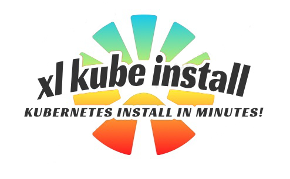

Workshop for installing Digital.ai Release and Digital.ai Deploy on a Kubernetes cluster using the `xl kube` command line interface.

## Prerequisites

- [kubectl](https://kubernetes.io/docs/tasks/tools/)
- [xl-cli 22.3.2](https://dist.xebialabs.com/public/xl-cli/22.3.2/) - [Installation instructions](https://docs.digital.ai/bundle/devops-release-version-v.22.3/page/release/how-to/install-the-xl-cli.html)
- [yq](https://github.com/mikefarah/yq)

Optional

- Java 11 - keytool (only if you plan to use the generation of the keystore inside the xl-cli kube)
- [Azure Cli - az](https://learn.microsoft.com/en-us/cli/azure/install-azure-cli) - if you are working with Azure during workshop
- [minikube](https://minikube.sigs.k8s.io/docs/start/) - if you plan to use Minikube during workshop
- [docker](https://docs.docker.com/get-docker/) - if you plan to use Docker during workshop
- [helm](https://helm.sh/docs/intro/install/) - if you would like to get additional info 
- [k9s](https://k9scli.io/topics/install/) - Kubernetes CLI To Manage Your Clusters In Style

## Workshop Content

### General remarks

* `xl something --help` is your friend! For example: `xl kube install --help`
* Passwords are not in this repo. Ask workshop teachers for the needed credentials.

### [Part 0](./part-0/lab-0-setup-kubectl-context.md)

0. [Setup kubectl context](./part-0/lab-0-setup-kubectl-context.md)

### [Part 1](./part-1/lab-1-install-release.md)

1. [Install Digital.ai Release 22.2.4](./part-1/lab-1-install-release.md)
   - Wait for resources with `xl kube check`
   - Discover how to open the page and login
2. [Upgrade Release 22.3.1](./part-1/lab-2-upgrade-release.md)
3. [OIDC setup (use Identity service)](./part-1/lab-3-oidc-setup.md)
4. [Clean Release from cluster](./part-1/lab-4-clean-release.md)

### [Part 2](./part-2/lab-5-install-deploy.md)

5. [Install Deploy with –files 22.3.1](./part-2/lab-5-install-deploy.md)
   - Use private image registry for all images
   - Discover how to open the page and login
6. [Clean Deploy from cluster](./part-2/lab-6-clean-deploy.md)

### [Part 3](./part-3/lab-7-troubleshoot.md)

7. [Fix errors - Troubleshoot](./part-3/lab-7-troubleshoot.md)
    - Use wrong tag
    - Use for postgres wrong storageclass
8. [How to change configuration file](./part-3/lab-8-change-configuration-file.md)

## Workshop Agenda

1. Introduction - PowerPoint
2. Work on Labs
   - Part 0
   - Part 1
   - Part 2
   - Part 3

## TODOs

- License for participants
- Test multiple installation of release and deploy on the same cluster
- Test on minikube
- Test on docker
- Max name of the namespace
