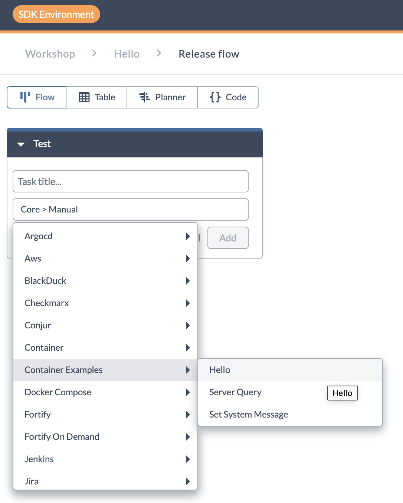
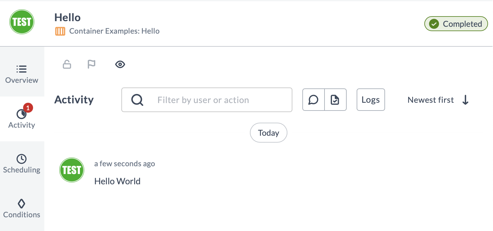

# Lab 1 - Run Hello World

In this section we will build and install the integration plugin into Digital.ai Release and then run a release that contains a simple Hello World task.

## Configure your `hosts` file

The Release server needs to be able to find the container images of the integration you are creating. In order to do so the development setup has its own registry running inside Docker. Add the address of the registry to your local machine's `hosts` file.

**Unix / macOS**

Add the following lines to `/etc/hosts` (sudo privileges is required to edit):

    127.0.0.1 digitalai.release.local
    127.0.0.1 container-registry
    127.0.0.1 host.docker.internal

**Windows**

Add the following entries to `C:\Windows\System32\drivers\etc\hosts` (Run as administrator permission is required to edit):

    127.0.0.1 digitalai.release.local
    127.0.0.1 container-registry
    127.0.0.1 host.docker.internal

### Build integration plugin and publish the container image

A container-based integration plugin consists of two parts
1. The metadata in the plugin `jar` file. This is the file that we will install into Digital.ai Release
2. The container image containing the code that will be executed when a task runs.

We will create both by running the build script. Open a new terminal window and navigate to the top-level directory of the repository

**Unix / macOS**

```commandline
cd release-integration-template-python
sh build.sh 
```

**Windows**

```commandline
cd release-integration-template-python
build.bat 
```

This builds the jar and the container image and pushes the image to the registry running in Docker.

### Install plugin into Release

We will now install the plugin into Digital.ai Release 

Go to the [Installed plugins](http://localhost:5516/#/pluginManager) section of the Plugin Manager page in Release.

Press the **Upload** button in the upper right corner and browse to the `build` directory of the `release-integration-template-python` project.
The plugin jar takes the name of the project specified in `project.properties`, for example `publisher-release-target-integration-0.0.1.jar`. Select this file and press **Upload**.

In order to activate the plugin, we need to restart the Release server.

Restart the Release container with the following command, or find the restart button in the Docker Desktop UI to do so

    docker restart dev-environment-digitalai-release-1

When the Release server has restarted, refresh the UI by pressing Reload in the browser.

💡 **Note:** We are currently working on a feature that makes it possible to install plugins without needing to restart the Release server. Stay tuned! 

### Test it!

✍️ **Assignment**

 * In Release, create a new folder called **Workshop** 
 * In the new folder, create a template **Hello** that contains the task **Container Example: Hello** 



Now run it! 

You will see the greeting in the **Activity** section of the task



Congratulations, you just ran your first container-based plugin!

---

[Next](lab-2-create-project-repository.md)

