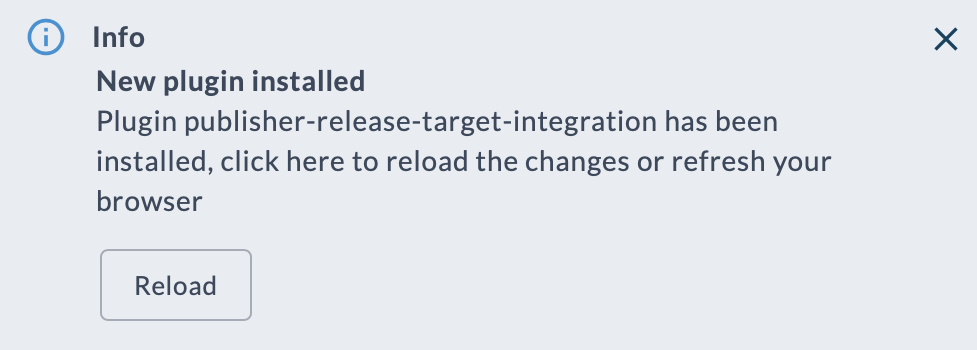

# Lab 1 - Run Hello World

In this section we will build and install the integration plugin into Digital.ai Release and then run a release that contains a simple Hello World task.

## Configure your `hosts` file

The Release server needs to be able to find the container images of the integration you are creating. In order to do so the development setup has its own registry running inside Docker. Add the address of the registry to your local machine's `hosts` file.

**Windows**

Add the following entries to `C:\Windows\System32\drivers\etc\hosts` (Run as administrator permission is required to edit):

    # Digital.ai Release SDK
    127.0.0.1 digitalai.release.local
    127.0.0.1 container-registry
    127.0.0.1 host.docker.internal

**Unix / macOS**

Add the following lines to `/etc/hosts` (sudo privileges is required to edit):

    # Digital.ai Release SDK
    127.0.0.1 digitalai.release.local
    127.0.0.1 container-registry
    127.0.0.1 host.docker.internal

Check if the changes were applied correctly by opening Digital.ai Release on http://digitalai.release.local:5516

### Build integration plugin and publish the container image

A container-based integration plugin consists of two parts
1. The container image containing the code that will be executed when a task runs.
2. The metadata in the plugin `zip` file. This is the file that we will install into Digital.ai Release

We will create both by running the build script. Open a new terminal window and navigate to the top-level directory of the repository

**Windows**

```commandline
cd release-integration-template-python
build.bat 
```

**Unix / macOS**

```commandline
cd release-integration-template-python
sh build.sh 
```

This builds both the plugin zip file and the container image and pushes the image to the local registry running in Docker.

### Install plugin into Release

The next step is to install the plugin into Digital.ai Release.

Simply issue the following command:

**Windows**

```commandline
xlw.bat plugin release install --file build/publisher-release-target-integration-0.0.1.zip 
```

**Unix / macOS**

```commandline
sh build.sh plugin release install --file build/publisher-release-target-integration-0.0.1.zip
```

The plugin is installed immediately, no restart is required.

When going to the UI, you will see this pop up



Refresh the browser and the plugin is ready for use. 

### Build and install in one go

It is also possible to combine the build and install step into one with `--upload` flag in the build command.

**Windows**

```commandline
build.bat --upload 
```

**Unix / macOS**

```commandline
sh build.sh --upload
```

### Test it!

Now that the plugin is installed in Release, let's take it for a spin. The plugin contains a simple Hello World task that is run as a container.

✍️ **Assignment**

 * In Release, create a new folder called **Workshop** 
 * In the new folder, create a template **Hello** that contains the task **Container Example: Hello** 


Run the template. 

You will see the greeting in the **Activity** section of the task


Congratulations, you just ran your first container-based plugin!

---

[Next](lab-2-create-project-repository.md)

