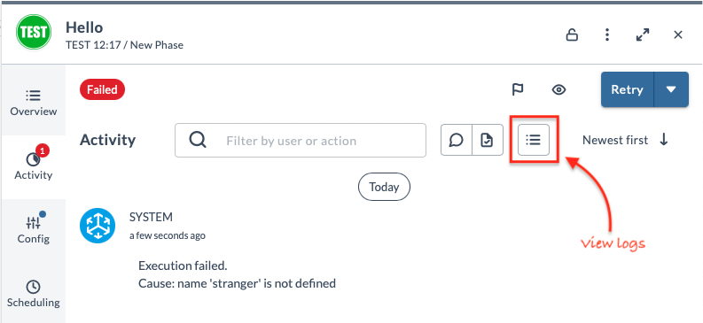
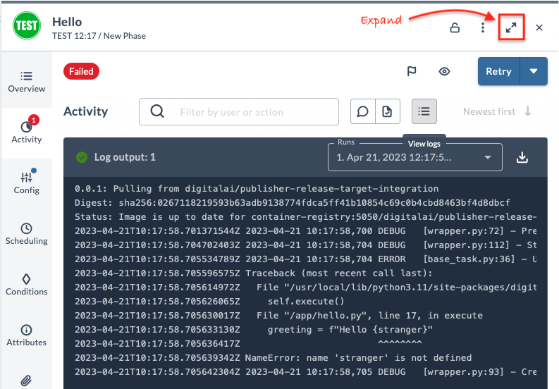

# Lab 4 - Define a new task and test

In this section we will define and code a new task, based on the `Hello` example task.

## Type definition

First, we will define the name and properties of the task so Digital.ai Release can handle it.

We will do this in the file `type-definitions.yaml`.

💡 **Note:** If you have written plugins for Release before: this is a new format taking the place of `synthetic.xml`. 

What will do is
* Take the `type-definitions.yaml` from the template
* Rename `containerExamples.BaseTask` to `workshop.BaseTask`
* Rename `containerExamples.Hello` to `workshop.Greet`
* Remove the rest

The result would be:

```yaml
types:
  workshop.BaseTask:
    extends: xlrelease.ContainerTask
    virtual: true

    hidden-properties:
      image:
        default: "@registry.url@/@registry.org@/@project.name@:@project.version@"
        transient: true
      iconLocation: test.png
      taskColor: "#667385"


  workshop.Greet:
    extends: workshop.BaseTask  # Don't forget to extend the new base task
    description: "Simple greeter task"

    input-properties:
      yourName:
        description: The name to greet
        kind: string
        default: World

    output-properties:
      greeting:
        kind: string
```

With this metadata and other artifacts like icons, Release will be able to display the task in the UI and execute it. 
When building, it will be put in the `jar` file that is uploaded to the Release server.

But first, we need to get the code in shape!

## Update Python code

Based on `type-definitions.yaml`, the Python SDK will scan the `src` directory for Python classes with the same name as the type definition.

In the template project, there is a `containerExamples.Hello` task defined in `type-defintions.yaml` with a corresponding `Hello` class in `src/hello.py`.

To make everything consistent again, do the following

* Rename `hello.py` to `greet.py`
* Inside `hello.py`, rename the `Hello` class to `Greet`
* Remove the unused files `sample_release_api_task.py` and `sample_server_task.py`

Now we are ready to build and test the plugin

Repeat the steps from [Lab 1](lab-1-run-hello-world.md#build-integration-plugin-and-publish-the-container-image)

In summary:
* Build using `sh build.sh` or `build.bat`
* Upload plugin
* Restart server
* Create a test template with the new task
* Run it

Ok, this takes a bit, but it does validate if the integration plugin is built correctly. The debug/test loop can be shortened by using [Unit tests](#using-unit-tests), that we will cover at the end of this exercise.

But first, let's highlight a couple of features

### Update code without restarting Release

Since the container is outside of Release, we don't need to restart the server if we change the code. Only if we are installing a new plugin, or touching `type-definitions.yaml` are restarts required.

Test this out by changing the code in `greet.py`. Change the greeting to something like 

```python
greeting = f"Hello {name}, welcome to the SDK workshop!"
```

Now we only need to build the container. After running the build script, go back to Release and create another release from your test template. The changes in the code are picked up right away.

## Code, build, test in a server

Another feature worth highlighting is more extensive logging. Let's introduce an error in the code, by changing the greeting line to

```python
greeting = f"Hello {stranger}" 
```

Do the build and run the task again. It should fail!
You will get an error summary on the Activity page. 



What's more, you can see the detailed logs by clicking on the **View logs** button



You can make the log area large by clicking on the **Expand** button.

## Using unit tests

It's pleasing to see your task running in Release. Less so if it fails... 

Luckily we can also run unit tests, catching most errors before we even install the integration plugin.

Unit tests are in the `test` directory. First let's modify the example tests that came with the template

✍️ **Assignment**

1. Rename `test_hello.py` and inside the file, rename all references to 'Hello' to 'Greet'
2. Remove the `test_with_server.py` file

You can now run the unit tests with the command

    python3 -m unittest discover tests

If all went well, you should get the following error:

```
Unexpected error occurred.
Traceback (most recent call last):
  File "/Users/hsiemelink/Code/release-integration-template-python/venv/lib/python3.11/site-packages/digitalai/release/integration/base_task.py", line 29, in execute_task
    self.execute()
  File "/Users/hsiemelink/Code/hes-integration-workshop-python/src/greet.py", line 17, in execute
    greeting = f"Hello {stranger}"
                        ^^^^^^^^
NameError: name 'stranger' is not defined
E.
======================================================================
ERROR: test_hello (test_hello.TestHello.test_hello)
----------------------------------------------------------------------
Traceback (most recent call last):
  File "/Users/hsiemelink/Code/hes-integration-workshop-python/tests/test_greet.py", line 21, in test_greet
    self.assertEqual(task.get_output_properties()['greeting'], 'Hello World')
                     ~~~~~~~~~~~~~~~~~~~~~~~~~~~~^^^^^^^^^^^^
KeyError: 'greeting'

----------------------------------------------------------------------
Ran 2 tests in 0.364s

FAILED (errors=1)
```

✍️ **Assignment** 
* Fix the code so the test runs without failure. Then build and retest in the Release server. 

## Do some coding!

Before we move on, try out some coding for yourself

✍️ **Assignment**
* Create another task in Python. Define a new type, with input and output variables. Keep it simple and just use standard Python libraries. We will touch more advanced topics in the next parts.

This concludes the first leg of our workshop. Congratulations, you are now able to build container-based plugins for Digital.ai Release! 

## Next

The rest of the workshop builds on the knowledge you have acquired so far. 

If you are more interested in coding, continue with
* [Part 2](../part-2) - How to integrate with a 3rd party system, using external Python libraries.

If you want to know how to set up a Kubernetes cluster for Digital.ai Release task execution, you can skip to
* [Part 3](../part-3) - Production Setup with Kubernetes, using the Remote Runner


