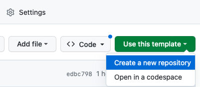

# Lab 2 - Create a dedicated repository for your integration

In this section we will set up a new Git project that will contain the plugin integration.

The `release-integration-template-python` repo is a template project, meaning you shouldn't make changes to it or fork it. 

We will create a **duplicate** of this project to start developing our own container-based integration.


## Create a new repository

Before you duplicate the contents of the template repository, you already need a new repository to push to.

We have the following naming convention for developing Digital.ai Release integration plugins:

    [publisher]-release-[target]-integration

Where publisher would be the name of your company.
For the workshop, just use your own name for [publisher] and `workshop` for [target]

For example: `hes-release-workshop-integration`

We need to initialize a Git repository with this name and note the url.  

This can be done easily from GitHub. Just navigate to the mainpage of the cd release-integration-template-python project and find the **Use this template** button, and select **Create new repository**. 



**⚠️ NOTE:**  You need a GitHub account to do so.

Follow the instructions on GitHub to create the new repository.
Note the URL of the new repository. XXX screenshot where you can find it

## Check out repository

Now open Terminal and navigate to the directory where you store your projects. Get the new repo with the following command: 

**HTTPS:**

    git clone https://github.com/digital-ai/YOUR_NAME-release-workshop-integration.git

## Configure the project

Change the following line in `project.properties`:

```
PLUGIN=YOUR_NAME-release-workshop-integration
...
```

---
[Next](../part-2/lab-3-setup-python-and-ide.md)
