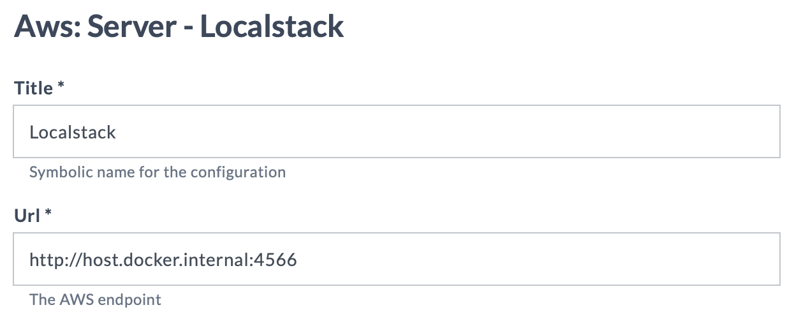

# Lab 5 - Create an integration to 3rd party server

In the previous labs, we have provided a guided tour through the features of the Digital.ai Release Integration SDK.

Based on what you have learnt, now we will give you a more open-ended assignment. 

✍️ **Assignment**
* Create an integration to AWS S3
* Provide tasks for creating a new bucket and listing the existing buckets

Don't panic! Follow the checklist and notes below 

## New integration checklist

For each new integration, you will need to do the following steps. 

- [ ] Create a new project from [release-integration-template-python](https://github.com/digital-ai/release-integration-template-python)
- [ ] Check out project and update project properties
- [ ] Configure IDE
- [ ] Create Python virtual environment
- [ ] Add libraries and pip install
- [ ] Remove sample files you won’t need
- [ ] Create skeleton implementation and tests
- [ ] Set up testing infrastructure
- [ ] Develop and test
- [ ] Extract properties and define type-modifications.yaml
- [ ] Test in Release

## Notes for AWS S3 assignment

### Create a new project

Think of a name of the project that follows the naming conventions, somehting like 'yourname-release-aws-integration`.

Create a new project from [release-integration-template-python](https://github.com/digital-ai/release-integration-template-python).

See [Lab 2](../part-1/lab-2-create-project-repository.md)

### Check out project

Make sure you update `project.properties` with the name of your project.

See [Lab 2](../part-1/lab-2-create-project-repository.md)

### Create Python virtual environment

Python command to create a local virtual environment:

    python -m venv venv

Alternatively, use the following command that takes a bit longer but makes sure you are on the latest version of the Python libraries, including pip. (May not work on older versions of Python)

    python -m venv --upgrade-deps venv

Then activate the virtual environment with

**Windows:**

    venv\Scripts\activate

**Linux / macOS:**

    source venv/bin/activate

To exit from a (previous) virtual environment, use the command 

    deactivate

See [Lab 3](../part-1/lab-3-setup-python-and-ide.md)

### Add libraries

Libraries are defined in `requirements.txt`. 

Hunt for the external libraries that you need on [pypi.org](https://pypi.org).

To integrate with AWS form Python, the recommended library is Boto3. Add it to `requirements.txt` with the following line:

    boto3 == 1.34.127

⚡️ **Note:** Don't forget to check if the library is trustworthy and that you are on the latest stable version.

Use `pip` to install the libraries

    pip install -r requirements.txt

See [Lab 3](../part-1/lab-3-setup-python-and-ide.md)

### Configure IDE

With the libs in place, now is the time to configure your preferred IDE.

See [Lab 3](../part-1/lab-3-setup-python-and-ide.md)

### Remove sample files you won’t need

The template project contains some boiler plate sample files. Usually you just pick one to get started and delete the rest so they are no in the way.

Choose the one that is suitable for your projects

* `hello.py` -- The simplest, used for generic tasks.
* `sample_release_api_task.py` -- To interact with the Release API.
* `sample_server_task.py` -- To make http requests and interact with third party servers.   **⬅ _We need this one for AWS_**

Remove the files you don't need. Also check the test directory.

### Create skeleton implementation and tests

The quickest development cycle is by using unit tests, you don't want to be installing your task into Release to test it every time you make a change.

Start with an empty skeleton and make sure you can unit tests with it. Then iteratively expand the task implementation and tests.

First, run the tests to make sure that we are in a good state

    python -m unittest discover tests

Use `sample_server_task.py` as a base and remove the stuff you won't need. For AWS, you wouldn't need the `requests` library, the boto3 library takes care of that. So you can remove that and start with a clean, but non-trivial file.

Here's an example of what the starting point could look like

`sample_server_task.py`:
```python
from digitalai.release.integration import BaseTask

import boto3   # Test if IDE does code completion  


class ServerQuery(BaseTask):
    """
        Creates an S3 bucket on AWS
    """

    def execute(self) -> None:

        # Validate input
        server = self.input_properties['server']
        if server is None:
            raise ValueError("Server field cannot be empty")

        # TODO: Connect to AWS and create an S3 bucket using boto3
        
        # Set output
        self.set_output_property('location', 'bucket-location')
```

With the corresponding test in `test_with_server.py`:

```python
import unittest

from src.sample_server_task import ServerQuery


class TestServerQuery(unittest.TestCase):

    def test_server_query(self):

        # Given
        task = ServerQuery()
        task.input_properties = {
            'server': {
                'url': 'http://localhost:4566'
            }
        }

        # When
        task.execute_task()

        # Then
        self.assertEqual(task.get_output_properties()['location'], 'bucket-location')


if __name__ == '__main__':
    unittest.main()
```

Run the tests again and fix any errors.

Don't forget to commit to source control when tests are green!

💡**Note** Make small iterations and test with each change. Commit often.

This first thing you can do is to rename the files and classes so they more descriptive for the task. We recommend to use the IDE's refactoring capabilities and test after each step.

For example:
* Rename `sample_server_task.py` to `aws_s3_tasks.py`
* Rename `test_with_server.py` to `test_aws_s3_tasks.py`
* Rename the class `ServerQuery` to `CreateS3Bucket`
* Etcetera...

💡**Note:** Since we are not testing with Release yet, you won't have to propagate changes `type-defintions.yaml` yet. This will come later in the development cycle.

Before we dive into coding, let's take a look at the other essential part of developing integration plugins: the integration test infrastructure.

### Set up integration test infrastructure

Make sure you have a test environment of the target system to test your integration. For example, you would need a test environment and account to connect to.

If possible, it is useful to have a local test environment in Docker that is self-contained.  

For AWS, we can set up a local environment inside Docker using [Localstack](https://localstack.cloud) -- an environment that supports many of the AWS APIs.

Here's a snippet to set up a Docker environment for Localstack. Append it to `dev-environment/docker-compose.yaml`, making sure it is defined under `services`. (It's Yaml, so double check indentation) 

```yaml
  localstack:
    image: localstack/localstack
    ports:
      - "4566:4566"            # LocalStack Gateway
      - "4510-4559:4510-4559"  # external services port range
    environment:
      - DEBUG=${DEBUG-}
      - DOCKER_HOST=unix:///var/run/docker.sock
    volumes:
      - "${LOCALSTACK_VOLUME_DIR:-./localstack}:/var/lib/localstack"
      - "/var/run/docker.sock:/var/run/docker.sock"
```

With this change, the Localstack environment will be available on `htp://localhost:4566`

Recycle your Docker environment with

    cd dev-environment
    docker compose down
    docker compose up -d --build

While Localstack is starting, you can go back to the code and start developing the task with boto3.

### Develop and test

Update the task code to work with boto3. The relevant snippet to make it work is

```python
s3_client = boto3.client('s3', endpoint_url=server['url'], region_name='eu-west-2',
                      aws_access_key_id="", aws_secret_access_key="")

response = s3_client.create_bucket(Bucket='new-bucket')
```

✍️ **Assignment**

Make the unit tests work with Localstack.
1. Adapt your code with the above snippet 
2. Run the unit tests against localstack
3. Set the task output property according to the response of the boto3 call. Use the [Boto 3 documentation](https://boto3.amazonaws.com/v1/documentation/api/latest/reference/services/s3/client/create_bucket.html#) to extract the right property from the response.
4. Test
5. Add an input property to task and test code
6. Test


### Extract properties and define type-modifications.yaml

Now that the task code is finished and the tests run fine, it is time to create the package for Release.

✍️ **Assignment**

Open the file `type-modifications.yaml` and do the following.

💡**Note:** PyCharm provides auto-completion on this file. 

1. Remove unneeded classes
2. Rename base type from `containerExamples.BaseTask` to one that is specific to your project, for example `aws.BaseTask`. 💡 Use Find & Replace! 
3. Add task types for Creating and Listing the buckets
4. Define input and output properties
5. Make sure the name of the type in `type-definitions.yaml` corresponds with the name of the Python class
6. Make the Python code extracts the right input properties and sets the right output properties
7. Create a type for the Server endpoint, for example `aws.Server`. Make sure the tasks refer to this server type.

See [Lab 4](../part-1/lab-4-define-a-new-task-and-test.md#type-definition)


### Test in Release

When `type-defintions.yaml` are in order, build the container and jar file.

Upload it to Release, restart the server and create a test template. 

See [Lab 1](../part-1/lab-1-run-hello-world.md)

Configure the address for the AWS endpoint to be

    http://host.docker.internal:4566



Run your test template.

### New task: List buckets

When you have the 'create' example working, take a crack at the 'List buckets' task.

Use the [S3 documentation for `list_buckets`](https://boto3.amazonaws.com/v1/documentation/api/latest/reference/services/s3/client/list_buckets.html) as a reference

✍️ **Assignment**
1. Create a task that lists the available buckets on S3
2. Create and run a unit test for it
3. Define a task type, create a jar package and test it in Release 

---
[Next](../part-3/lab-6-prepare-for-kubernetes.md)