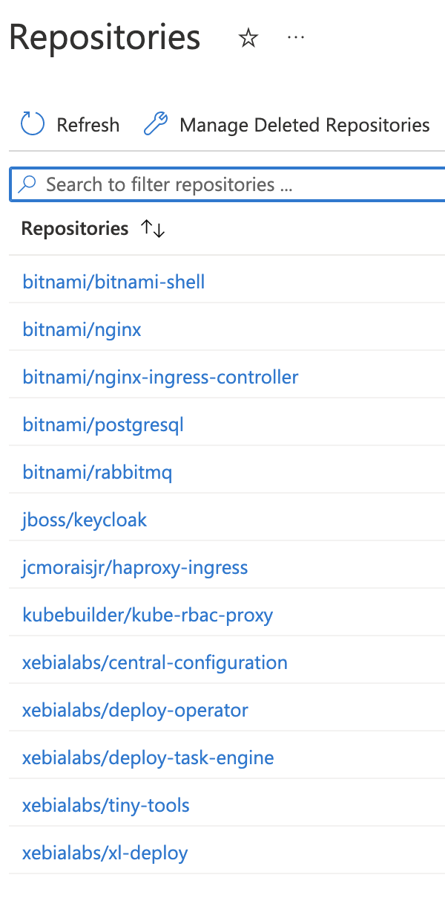

# Lab 5 - Install Deploy with –files 22.3.1 and use private image registry for all images

For this lab we will do installation of the Digital.ai Deploy. The installation will be done in two phases. 
In the first we will generate all files, and in the second we will apply the files to the cluster.
After first part we will change generated files. The changes in the generated files will:
- define Azure DNS settings;
- use private container registry azureakstestcluster.azurecr.io to get all images.

`xl kube` uses blueprints from the [https://dist.xebialabs.com/public/xl-op-blueprints/](https://dist.xebialabs.com/public/xl-op-blueprints/).
For the cases when working environment does not have access to Internet, we can download the blueprints to use them from local directory.
The zip version of blueprints we can download from 
[https://nexus.xebialabs.com/nexus/content/repositories/digitalai-public/ai/digital/xlclient/blueprints/xl-op-blueprints/](https://nexus.xebialabs.com/nexus/content/repositories/digitalai-public/ai/digital/xlclient/blueprints/xl-op-blueprints/).

## Installation

Download the blueprints for the current version:
[https://nexus.xebialabs.com/nexus/content/repositories/digitalai-public/ai/digital/xlclient/blueprints/xl-op-blueprints/22.3.2/xl-op-blueprints-22.3.2.zip](https://nexus.xebialabs.com/nexus/content/repositories/digitalai-public/ai/digital/xlclient/blueprints/xl-op-blueprints/22.3.2/xl-op-blueprints-22.3.2.zip).
Unzip the `xl-op-blueprints-22.3.2.zip` to the working directory and use it with `--local-repo` flag.

### Dry-run installation

Run the installation with `--dry-run`, that command will just generate the files in the local directory.

```shell
xl kube install --dry-run --local-repo ./xl-op-blueprints
```

For the example use following answers (example on the Azure):

```text
? Following kubectl context will be used during execution: `minikube`? Yes
? Select the Kubernetes setup where the Digital.ai Devops Platform will be installed, updated or cleaned: PlainK8s [Plain multi-node K8s cluster]
? Do you want to use an custom Kubernetes namespace (current default is 'digitalai'): Yes
? Enter the name of the Kubernetes namespace where the Digital.ai DevOps Platform will be installed, updated or cleaned: my-namespace
? Product server you want to perform install for: dai-deploy [Digital.ai Deploy]
? Enter the repository name (eg: <repositoryName> from <repositoryName>/<imageName>:<tagName>): azureakstestcluster.azurecr.io/xebialabs
? Enter the deploy server image name (eg: <imageName> from <repositoryName>/<imageName>:<tagName>): xl-deploy
? Enter the image tag (eg: <tagName> from <repositoryName>/<imageName>:<tagName>): 22.3.1
? Enter the deploy task engine image name for version 22 and above (eg: <imageName> from <repositoryName>/<imageName>:<tagName>): deploy-task-engine
? Enter the central configuration image name for version 22 and above (eg: <imageName> from <repositoryName>/<imageName>:<tagName>): central-configuration
? Enter the deploy master server replica count: 2
? Enter PVC size for Deploy master (Gi): 1
? Select between supported Access Modes: ReadWriteOnce [ReadWriteOnce]
? Enter the deploy worker replica count: 2
? Enter PVC size for Deploy worker (Gi): 1
? Enter PVC size for Central Configuration (Gi): 0.500000
? Select between supported ingress types: nginx [NGINX]
? Do you want to enable an TLS/SSL configuration (if yes, requires existing TLS secret in the namespace): No
? Provide DNS name for accessing UI of the server: my-namespace-xld.northcentralus.cloudapp.azure.com
? Provide administrator password: 30Q5utfMV6O9wnHF
? Type of the OIDC configuration: no-oidc [No OIDC Configuration]
? Enter the operator image to use (eg: <repositoryName>/<imageName>:<tagName>): azureakstestcluster.azurecr.io/xebialabs/deploy-operator:22.3.1
? Select source of the license: file [Path to the license file (the file can be in clean text or base64 encoded)]
? Provide license file for the server: ./xld-license.lic
? Select source of the repository keystore: generate [Generate the repository keystore during installation (you need to have keytool utility installed in your path)]
? Provide keystore passphrase: 1uwAFCtUJEdwmaDi
? Provide storage class for the server: azure-aks-test-cluster-file-storage-class
? Do you want to install a new PostgreSQL on the cluster: Yes
? Provide Storage Class to be defined for PostgreSQL: azure-aks-test-cluster-disk-storage-class
? Provide PVC size for PostgreSQL (Gi): 1
? Do you want to install a new RabbitMQ on the cluster: Yes
? Replica count to be defined for RabbitMQ: 1
? Storage Class to be defined for RabbitMQ: azure-aks-test-cluster-file-storage-class
? Provide PVC size for RabbitMQ (Gi): 1

...

? Do you want to proceed to the deployment with these values? Yes
For current process files will be generated in the: digitalai/dai-deploy/digitalai/20221020-001911/kubernetes
Generated answers file successfully: digitalai/generated_answers_dai-deploy_digitalai_install-20221020-001911.yaml
Starting install processing.
...
```

We are using here private registry so we need to add `azureakstestcluster.azurecr.io` to the repository name.

Here all notes for the license, storage class and hostname will be same from the Release Part 1. 

For the other questions and answers details check [Installation Wizard for Digital.ai Deploy](https://docs.digital.ai/bundle/devops-deploy-version-v.22.3/page/deploy/operator/xl-op-install-wizard-deploy.html)

Dry run will generate the files in the working folder, in the `digitalai/dai-deploy/digitalai/20221020-001911/kubernetes` folder like the example says.


### Edit generated files and update the image repository

Go through generated files and update the image repository.
There are 3 files that we need to update in the `digitalai/dai-deploy/digitalai/20221020-001911/kubernetes` directory.

The `spec.centralConfiguration.image.repository`, `spec.ServerImageRepository` and `spec.WorkerImageRepository` should have already correct value.

On the private registry we have following images:




#### kubernetes/dai-deploy_cr.yaml

Update following in the file:

- spec.TinyToolsImageRepository: "azureakstestcluster.azurecr.io/xebialabs/tiny-tools"

##### If you are using nginx

- spec.nginx-ingress-controller.defaultBackend.image.registry: azureakstestcluster.azurecr.io
- spec.nginx-ingress-controller.defaultBackend.image.repository: bitnami/nginx
- spec.nginx-ingress-controller.image.registry: azureakstestcluster.azurecr.io
- spec.nginx-ingress-controller.image.repository: bitnami/nginx-ingress-controller

##### If you are using haproxy

- spec.haproxy-ingress.controller.image.repository: azureakstestcluster.azurecr.io/jcmoraisjr/haproxy-ingress

##### If you are using embedded keycloak

- spec.keycloak.image.repository: azureakstestcluster.azurecr.io/jboss/keycloak
- spec.keycloak.postgresql.image.registry: azureakstestcluster.azurecr.io
- spec.keycloak.postgresql.image.repository: bitnami/postgresql

##### If you are using embedded postgresql

- spec.postgresql.image.registry: azureakstestcluster.azurecr.io
- spec.postgresql.image.repository: bitnami/postgresql

##### If you are using embedded rabbitmq

- spec.rabbitmq.image.registry: azureakstestcluster.azurecr.io
- spec.rabbitmq.image.repository: bitnami/rabbitmq
- spec.rabbitmq.volumePermissions.image.registry: azureakstestcluster.azurecr.io
- spec.rabbitmq.volumePermissions.image.repository: bitnami/bitnami-shell

#### kubernetes/template/deployment.yaml

Update following in the file:

- spec.template.spec.containers[0].image: azureakstestcluster.azurecr.io/kubebuilder/kube-rbac-proxy:v0.8.0

The `spec.template.spec.containers[1].image` should have already correct value.

#### kubernetes/template/postgresql-init-keycloak-db.yaml

Update following in the file:

- spec.template.spec.initContainers[0].image: azureakstestcluster.azurecr.io/xebialabs/tiny-tools:22.2.0
- spec.template.spec.containers[0].image: azureakstestcluster.azurecr.io/xebialabs/tiny-tools:22.2.0


### Edit generated files and update the Azure DNS setup

Other way to edit CR, open the `digitalai/dai-deploy/my-namespace/20221020-001911/kubernetes/dai-deploy_cr.yaml`.

Update the with selected hostname in the yaml path of the CR file `spec.nginx-ingress-controller.service.annotations`, in our example it is `my-namespace-xld`:

```yaml
spec:
  
  nginx-ingress-controller:
    
    service:
      
      annotations:
        service.beta.kubernetes.io/azure-dns-label-name: my-namespace-xld
```

Save the changes in the file.


### Use `xl kube install` with changed files to apply everything to the cluster

Following command will apply the just changed files on the K8S cluster:

```shell
xl kube install --files 20221020-001911 --local-repo ./xl-op-blueprints
```

Under `--files` we are using the reference on the previous dry-run by using part of the unique name from the run.

```text
$ xl kube install --files 20221020-001911 --local-repo ./xl-op-blueprints
? Following kubectl context will be used during execution: `azure-aks-test-cluster`? Yes
TODO
```


After everything is on the cluster, you will see operator other resources pods running on the cluster.


## Wait for resources with xl kube check

After xl-cli finishes all resources are not yet ready on the cluster, try to run following checks that are waiting for the resources to be fully running and ready on the cluster.

Check for details with `xl kube check -h` for details what each flag is here.

```shell
xl kube check --wait-for-ready 5
xl kube check --wait-for-ready 5 --skip-collecting
xl kube check --wait-for-ready 5 --zip-files
```

For example output for the second command (the helm info on the end will be displayed if you have helm in the path):
Example is on the Azure.


For example output for the second command (the helm info on the end will be displayed if you have helm in the path):
Example is on the Azure.

```text
$ xl kube check --wait-for-ready 5 --skip-collecting
? Following kubectl context will be used during execution: `azure-aks-test-cluster`? Yes
? Select the Kubernetes setup where the Digital.ai Devops Platform will be installed, updated or cleaned: AzureAKS [Azure AKS]
? Do you want to use an custom Kubernetes namespace (current default is 'digitalai'): Yes
? Enter the name of the Kubernetes namespace where the Digital.ai DevOps Platform will be installed, updated or cleaned: my-namespace
? Product server you want to perform clean for: dai-deploy [Digital.ai Deploy]
	 -------------------------------- ----------------------------------------------------
	| LABEL                          | VALUE                                              |
	 -------------------------------- ----------------------------------------------------
	| CleanBefore                    | false                                              |
	| CreateNamespace                | true                                               |
	| ExternalOidcConf               | external: false                                    |
	| GenerationDateTime             | 20221101-001131                                    |
	| IngressType                    | nginx                                              |
	| K8sSetup                       | AzureAKS                                           |
	| Namespace                      | my-namespace                                       |
	| OidcConfigType                 | existing                                           |
	| OsType                         | darwin                                             |
	| ProcessType                    | check                                              |
	| ServerType                     | dai-deploy                                         |
	| ShortServerName                | xld                                                |
	| UseCustomNamespace             | true                                               |
	 -------------------------------- ----------------------------------------------------
For current process files will be generated in the: digitalai/dai-deploy/my-namespace/20221101-001131/kubernetes
Generated answers file successfully: digitalai/generated_answers_dai-deploy_my-namespace_check-20221101-001131.yaml
Collecting the CR data
Waiting for resources to be ready
Deployment deployment/xld-operator-controller-manager is available in the namespace my-namespace
Deployment deployment/dai-xld-my-namespace-nginx-ingress-controller is available in the namespace my-namespace
Deployment deployment/dai-xld-my-namespace-nginx-ingress-controller-default-backend is available in the namespace my-namespace
PVC pvc/data-dai-xld-my-namespace-rabbitmq-0 is bound in the namespace my-namespace
Pod pod/dai-xld-my-namespace-rabbitmq-0 is available in the namespace my-namespace
PVC pvc/data-dai-xld-my-namespace-postgresql-0 is bound in the namespace my-namespace
Pod pod/dai-xld-my-namespace-postgresql-0 is available in the namespace my-namespace
PVC pvc/data-dir-dai-xld-my-namespace-digitalai-deploy-cc-server-0 is bound in the namespace my-namespace
Pod pod/dai-xld-my-namespace-digitalai-deploy-cc-server-0 is available in the namespace my-namespace
PVC pvc/data-dir-dai-xld-my-namespace-digitalai-deploy-master-0 is bound in the namespace my-namespace
Pod pod/dai-xld-my-namespace-digitalai-deploy-master-0 is available in the namespace my-namespace
PVC pvc/data-dir-dai-xld-my-namespace-digitalai-deploy-master-1 is bound in the namespace my-namespace
Pod pod/dai-xld-my-namespace-digitalai-deploy-master-1 is available in the namespace my-namespace
PVC pvc/data-dir-dai-xld-my-namespace-digitalai-deploy-worker-0 is bound in the namespace my-namespace
Pod pod/dai-xld-my-namespace-digitalai-deploy-worker-0 is available in the namespace my-namespace
PVC pvc/data-dir-dai-xld-my-namespace-digitalai-deploy-worker-1 is bound in the namespace my-namespace
Pod pod/dai-xld-my-namespace-digitalai-deploy-worker-1 is available in the namespace my-namespace
Checking helm installation status
Operator's dai-xld-my-namespace helm status in the namespace my-namespace for the installation:
NAME: dai-xld-my-namespace
LAST DEPLOYED: Mon Oct 31 23:06:42 2022
NAMESPACE: my-namespace
STATUS: deployed
REVISION: 1
TEST SUITE: None
NOTES:
## To get the application URL, run:
http://my-namespace-xld.northcentralus.cloudapp.azure.com/

## To get the admin password for xl-deploy, run:
kubectl get secret --namespace my-namespace dai-xld-my-namespace-digitalai-deploy -o jsonpath="{.data.deploy-password}" | base64 --decode; echo
## To get the password for postgresql, run:
kubectl get secret --namespace  my-namespace dai-xld-my-namespace-postgresql -o jsonpath="{.data.postgresql-password}" | base64 --decode; echo

## To get the password for rabbitMQ, run:
kubectl get secret --namespace  my-namespace dai-xld-my-namespace-rabbitmq   -o jsonpath="{.data.rabbitmq-password}" | base64 --decode; echo

## To edit custom resource dai-xld-my-namespace
kubectl edit digitalaideploys.xld.digital.ai dai-xld-my-namespace -n my-namespace

## To restart deploy central configuration pods use restart of the statefulset
kubectl rollout restart sts dai-xld-my-namespace-digitalai-deploy-cc-server -n my-namespace

## To restart deploy master pods use restart of the statefulset
kubectl rollout restart sts dai-xld-my-namespace-digitalai-deploy-master -n my-namespace

## To restart deploy worker pods use restart of the statefulset
kubectl rollout restart sts dai-xld-my-namespace-digitalai-deploy-worker -n my-namespace

Check finished successfully!
```

## Discover how to open the page and login

Now try to open [http://my-namespace-xld.northcentralus.cloudapp.azure.com/](http://my-namespace-xld.northcentralus.cloudapp.azure.com/)

To check the password, you can get it with the command from the helm info (username is as always `admin`):
```shell
## To get the admin password for xl-deploy, run:
kubectl get secret --namespace my-namespace dai-xld-my-namespace-digitalai-deploy -o jsonpath="{.data.deploy-password}" | base64 --decode; echo
```
