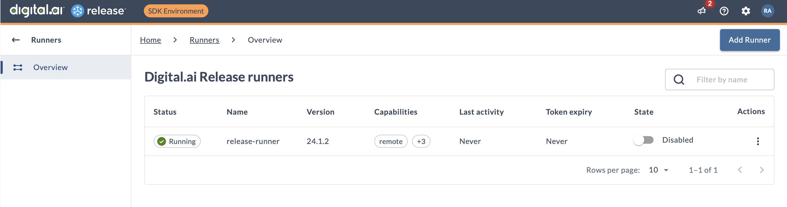

# Lab 7 - Installing the Release runner using `xl`

This lab teaches you how to install the Release runner into Kubernetes using the `xl` command line utility, the companion tool to Digital.ai Release and Deploy.


<!-- FIXME no longer needed -->

## Configure Digital.ai Release for Release runner

The runner connects to Release by using a token. To get a token, do the following

* Log in as `admin` in the Release UI. 
* Go to the [Access tokens](http://digitalai.release.local:5516/#/personal-access-token) page: In the top-right corner, click on the **RA** icon and select **Access tokens**
* Enter a token name, for example `Kubernetes runner`
* Select **Let me select permissions**, scroll to the bottom of the list and select **Runner registration**
* Click Generate. Copy the token and store it somewhere for future reference.

### Disable SDK runner

The SDK environment already contains a  runner running in plain Docker. We need to disable it as to make sure new tasks will be run in the Kubernetes runner we are about to install. 

In the Release UI, log in as **admin**. In the top right corner, click the cog wheel and select **[Runners](http://digitalai.release.local:5516/#/runners)**.

Disable the active runner by hitting the **Enabled** switch. The runner should now be disabled.




## Set up the runner

Install the Release runner into your local Kubernetes environment with the `xl kube install` command and look closely at the answers below. Note that sometimes you can take the default, sometimes you need to give the value as prompted below, and sometimes you need to give a custom value.

💡 **Note:** You can also use `xl kube install` to install Release or Deploy itself. See the [Installing Digital.ai Release onto Kubernetes](https://docs.digital.ai/bundle/devops-release-version-v.22.3/page/release/operator/xl-op-before-you-begin.html) on our documentation site.

Start the command with

    ./xlw kube install

We've marked some questions with a warning sign where you need to pay extra attention.

``` 
? Following kubectl context will be used during execution: `docker-desktop`?
» Yes
? Select the Kubernetes setup where the Digital.ai Devops Platform will be installed, updated or cleaned:
»⚠️ AWSEKS [AWS EKS]
⚡️ Choose the 'AWS' option when using Docker Desktop Kubernetes.
? Do you want to use an custom Kubernetes namespace (current default is 'digitalai'):
» No
? Do you want to create custom Kubernetes namespace digitalai, it does not exist: 
» Yes
? Product server you want to perform install for: 
»⚠️ dai-release-remote-runner [Digital.ai Release Runner]
? Select type of image registry:
» default
? Enter the Release Runner repository name (eg: <repositoryName> from <repositoryName>/<imageName>:<tagName>):
» xebialabs
? Enter the Release Runner image name (eg: <imageName> from <repositoryName>/<imageName>:<tagName>): 
» release-runner
? Enter the Release Runner image tag (eg: <tagName> from <repositoryName>/<imageName>:<tagName>):
» 24.1.3
? Enter the Release Runner Helm Chart release name: 
» release-runner
? Use default version of the Release Runner helm chart: Yes? 
» Yes
? Enter the Release URL that will be used by Release Runner:
»⚠️ http://host.docker.internal:5516
? Enter the Release Token that will be used by Release Runner:
»⚠️ rpa_... (Paste token here)
? Enter the Release Runner replica count:
» 1
? Enable truststore for Release Runner: 
» No
	 -------------------------------- ----------------------------------------------------
	| LABEL                          | VALUE                                              |
	 -------------------------------- ----------------------------------------------------
	| AdminPassword                  | TDA0nWciRxYGb7Ct                                   |
	| CleanBefore                    | false                                              |
	| CreateNamespace                | true                                               |
	| ExternalOidcConf               | external: false                                    |
	| GenerationDateTime             | 20240617-163517                                    |
	| ImageNameRemoteRunner          | release-runner                                     |
	| ImageRegistryType              | default                                            |
	| ImageTagRemoteRunner           | 24.1.3                                             |
	| IngressKeystoreSource          | generate                                           |
	| IngressType                    | nginx                                              |
	| IngressTypeGeneric             | nginx                                              |
	| IngressTypeOpenshift           | route                                              |
	| IsCustomImageRegistry          | false                                              |
	| IsRemoteRunnerTruststoreEnab.. | false                                              |
	| K8sSetup                       | AWSEKS                                             |
	| OidcConfigType                 | no-oidc                                            |
	| OsType                         | darwin                                             |
	| ProcessType                    | install                                            |
	| RemoteRunnerClean              | false                                              |
	| RemoteRunnerCount              | 1                                                  |
	| RemoteRunnerGeneration         | false                                              |
	| RemoteRunnerInstall            | true                                               |
	| RemoteRunnerInstallType        |                                                    |
	| RemoteRunnerReleaseName        | release-runner                                     |
	| RemoteRunnerReleaseUrl         | http://host.docker.internal:5516                   |
	| RemoteRunnerRepositoryName     | xebialabs                                          |
	| RemoteRunnerToken              | rpa_64566bb26d2e08f1e471a3e5d5ae3a8ec0de4c75       |
	| RemoteRunnerTokenExpiration    | 0                                                  |
	| RemoteRunnerUseDefaultLocation | true                                               |
	| RemoteRunnerUserEmail          | release-runner@no.reply                            |
	| RemoteRunnerUserPassword       | ca2YvEa93NKXr5Mu                                   |
	| ServerType                     | dai-release-runner                                 |
	| ShortServerName                | other                                              |
	| UseCustomNamespace             | false                                              |
	 -------------------------------- ----------------------------------------------------
For current process files will be generated in the: digitalai/dai-release-runner/digitalai/20240617-163517/kubernetes
Generated answers file successfully: digitalai/generated_answers_dai-release-runner_digitalai_install-20240617-163517.yaml 
Starting install processing.
Installing helm chart for Digital.ai Release Runner from: digitalai/dai-release-runner/digitalai/20240617-163517/kubernetes/runner-0.1.0.tgz
Using helm chart values from: digitalai/dai-release-runner/digitalai/20240617-163517/kubernetes/values-cli.yaml
Installed helm chart release-runner to namespace digitalai
```

Check the runner logs to see if it started correctly and is able to connect to Release.

We found **k9s** very helpful when dealing with Kubernetes. In a new terminal window, start the `k9s` utility and open the logs for the `remote-runner` pod to see if it is starting correctly.

## Check Runner in Release

In the Release UI as admin, check the **[Runners](http://digitalai.release.local:5516/#/runners)** page under settings. You should see an additional entry for the Remote Runner that was just installed.

Run one of the templates you built previously. 

The tasks should run inside Kubernetes. You can check this in `k9s` by looking for pods with random names like `fa6fdfd01554f848a5145343669693d4bc48d901`.


## Clean up

To remove the runner from Kubernetes, use the `xl kube clean` command, with the 'answers' file that was created during installation.

    ./xlw kube clean --skip-prompts --answers digitalai/generated_answers_dai-release-runner_digitalai_install-DATE.yaml 

If you are into Unix command line magic, you can use this command to do a clean with the last answers file generated:

    ./xlw kube clean --skip-prompts --answers `ls -t digitalai/generated_answers_dai-release-runner_digitalai_install-* | head -1`
