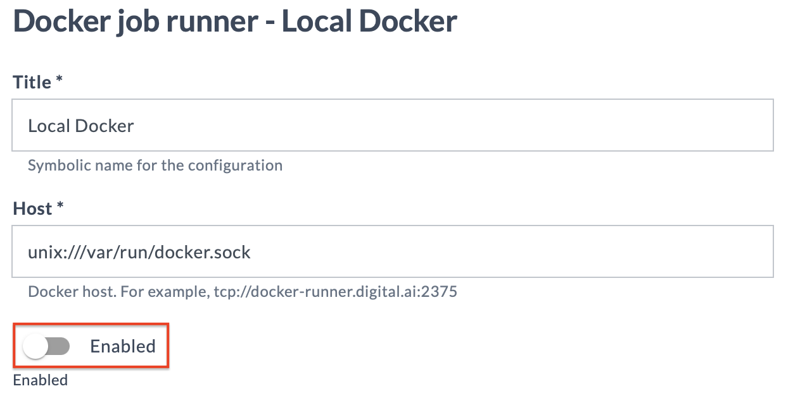

# Lab 7 - Installing the Remote Runner using `xl`

This lab teaches you how to install the Remote Runner using the `xl` command line utility, the companion tool to Digital.ai Release and Deploy.

## Configure Digital.ai Release for Remote Runner

We need to configure Release with a _service user_ for the Remote Runner and give it the needed permissions.

Use the following command to create an account for the Remote Runner. Feel free to use a different password.

    ./xlw apply -f remote-runnner-user.yaml --values password=Remote123

The Remote Runner needs a token to register itself with the Release server. In order to obtain a token, do the following

* Log in to release as the `remote-runner` user with the password you gave as a parameter to the `xl apply` command
* Go to the [Access tokens](http://digitalai.release.local:5516/#/personal-access-token) page: In the top-right corner, click on the **RR** icon and select **Access tokens**
* Enter a token name, for example `Local runner`, and click Generate. Copy the token and store it somewhere for future reference.


## Set up the runner

Install the Remote Runner into your local Kubernetes environment with the `xl kube install` command and look closely at the answers below. Note that sometimes you can take the default, sometimes you need to give the value as prompted below, and sometimes you need to give a custom value.

💡 **Note:** You can also use `xl kube install` to install Release or Deploy itself. See the [Installing Digital.ai Release onto Kubernetes](https://docs.digital.ai/bundle/devops-release-version-v.22.3/page/release/operator/xl-op-before-you-begin.html) on our documentation site.

Start the command with

    ./xlw kube install

We've marked some questions with a warning sign where you need to pay extra attention.

``` 
? Following kubectl context will be used during execution: `docker-desktop`?
» Yes
? Select the Kubernetes setup where the Digital.ai Devops Platform will be installed, updated or cleaned:
»⚠️ AWSEKS [AWS EKS]
⚡️ Choose the 'AWS' option when using Docker Desktop Kubernetes.
? Do you want to use an custom Kubernetes namespace (current default is 'digitalai'):
» No
? Product server you want to perform install for:
»⚠️ dai-release-runner [Remote Runner for Digital.ai Release]
? Select type of image registry:
» default
? Enter the repository name (eg: <repositoryName> from <repositoryName>/<imageName>:<tagName>):
» xebialabs
? Enter the remote runner image name (eg: <imageName> from <repositoryName>/<imageName>:<tagName>):
» xlr-remote-runner
? Enter the image tag (eg: <tagName> from <repositoryName>/<imageName>:<tagName>):
» 0.1.33
? Enter the Remote Runner Helm Chart release name: 
» remote-runner
? Use default version of the Remote Runner helm chart. 
» Yes
? Enter the Release URL that will be used by remote runner:
»⚠️ http://host.docker.internal:5516
? Enter the Release Token that will be used by remote runner:
»⚠️ rpa_... (Paste token here)
? Enter the remote runner replica count: 
» 1
? Provide storage class for the remote runner: hostpath
	 -------------------------------- ----------------------------------------------------
	| LABEL                          | VALUE                                              |
	 -------------------------------- ----------------------------------------------------
	| CleanBefore                    | false                                              |
	| CreateNamespace                | true                                               |
	| ExternalOidcConf               | external: false                                    |
	| GenerationDateTime             | 20230425-110838                                    |
	| ImageNameRemoteRunner          | xlr-remote-runner                                  |
	| ImageRegistryType              | default                                            |
	| ImageTagRemoteRunner           | 0.1.33                                             |
	| IngressType                    | nginx                                              |
	| IsCustomImageRegistry          | false                                              |
	| K8sSetup                       | PlainK8s                                           |
	| OidcConfigType                 | no-oidc                                            |
	| OsType                         | darwin                                             |
	| ProcessType                    | install                                            |
	| RemoteRunnerBaseHostPath       | /Users/hsiemelink/Code/release-integration-sdk-w.. |
	| RemoteRunnerCount              | 1                                                  |
	| RemoteRunnerReleaseName        | remote-runner                                      |
	| RemoteRunnerReleaseUrl         | http://host.docker.internal:5516                |
	| RemoteRunnerRepositoryName     | xebialabs                                          |
	| RemoteRunnerStorageClass       | hostpath                                           |
	| RemoteRunnerToken              | rpa_...                                            |
	| RemoteRunnerUseDefaultLocation | true                                               |
	| ServerType                     | dai-release-runner                                 |
	| ShortServerName                | other                                              |
	| UseCustomNamespace             | false                                              |
	 -------------------------------- ----------------------------------------------------
? Do you want to proceed to the deployment with these values? Yes
For current process files will be generated in the: digitalai/dai-remote-runner/digitalai/20230308-152423/kubernetes
Generated answers file successfully: digitalai/generated_answers_dai-release-runner_digitalai_install-20230308-152423.yaml 
Starting install processing.
Installing helm chart remote-runner from /Users/hsiemelink/Code/release-integration-template-python/doc/digitalai/dai-remote-runner/digitalai/20230308-152423/kubernetes/helm-chart
Installed helm chart remote-runner to namespace digitalai
```

Check the remote runner logs to see if it started correctly and is able to connect to Release.

We found **k9s** very helpful when dealing with Kubernetes. In a new terminal window, start the `k9s` utility and open the logs for the `remote-runner` pod to see if it is starting correctly.

## Check Runner in Release

In the Release UI, log in as **admin** and check the **[Connections](http://digitalai.release.local:5516/#/configuration)** page for Remote Runner connections. You should see an entry for Remote Runner.


Now disable the built-in Docker runner for the development environment by choosing **Edit** for the **Local Docker** entry and disabling the **Enabled** switch 



Run one of the templates you built previously. 

The tasks should run inside Kubernetes. You can check this in `k9s` by looking for pods called something like `92133d95a06d49c19c190869608b61b0-job-4`


## Clean up

To remove the Remote Runner from Kubernetes, use the `xl kube clean` command, with the 'answers' file that was created during installation.

    ./xlw kube clean --skip-prompts --answers digitalai/generated_answers_dai-release-runner_digitalai_install-DATE.yaml 

If you are into Unix command line magic, you can use this command to do the same:

    ./xlw kube clean --skip-prompts --answers `ls -t digitalai/generated_answers_dai-release-runner_digitalai_install-* | head -1`
