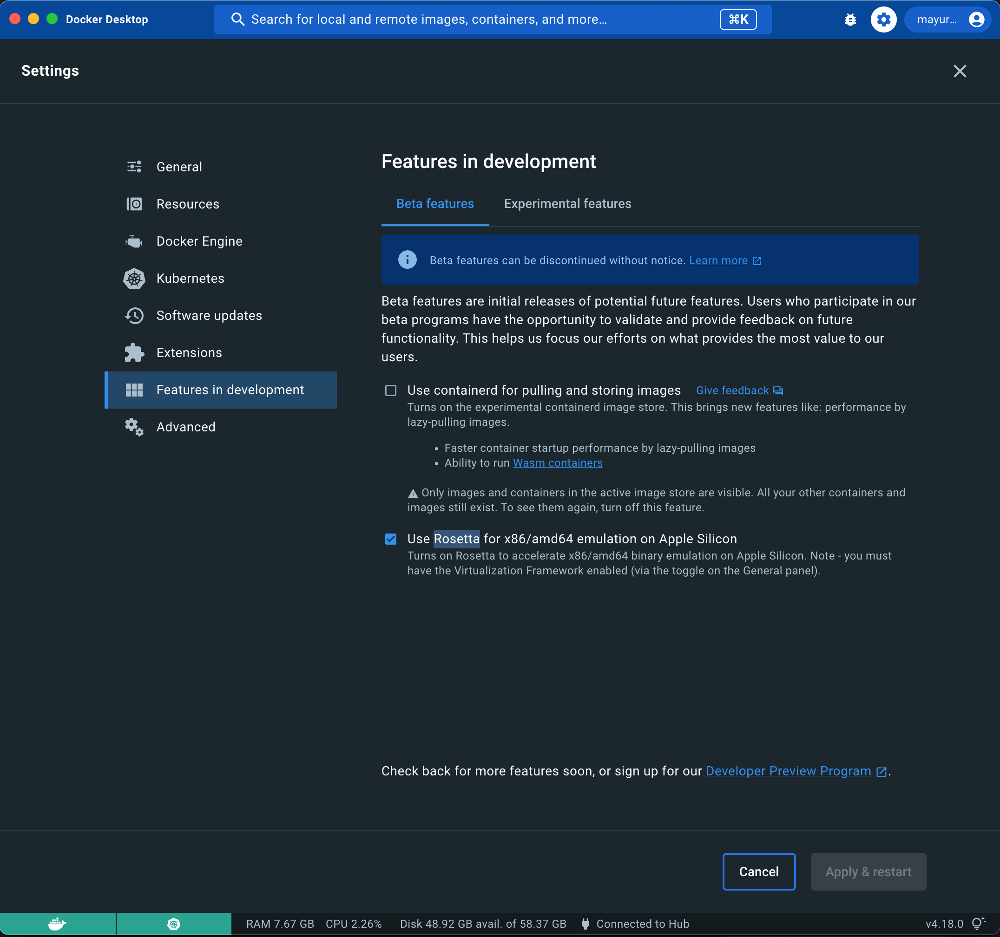

# Troubleshooting

## Release won't start

Release complains on startup and quits.

For example with the following message:

```
java.lang.IllegalStateException: Trying to register duplicate definition for type (...)
```

or

```
java.lang.NullPointerException: Could not find a type definition associated with type [containerExamples.BaseTask]
```

This is usually caused by a plugin with incorrect an `type-definitions.yaml` file

The easiest way is to simply reset the dev environment by doing

    docker compose down
    docker compose up -d --build

Unfortunately you will lose your work!

(We are currently working on ways to prevent this situation)

## Release won't start

Release gets stuck when starting with the following messages in the log:
```
2023-04-26 12:27:50.233 [main] {} INFO  l.lockservice.StandardLockService - Waiting for changelog lock....
2023-04-26 12:28:00.243 [main] {} INFO  l.lockservice.StandardLockService - Waiting for changelog lock....
```

**Workaround:** Reset the dev environment by doing

    docker compose down
    docker compose up -d --build

## My task doesn't show up in the Add task menu

* Refresh your browser

## My task shows up but properties are missing

* Refresh your browser

## (M1 Mac) qemu: uncaught target signal 11 (Segmentation fault) - core dumped

Happens when starting digitalai-release-setup container. So far only seen on M1.

* **Solution:** Upgrade to Macos Ventura

* **Workaround 1** Configure the Release server with the command 

  xl apply -f dev-environment/digitalai-release-setup/instance-configuration.yaml

Install the xl command utility for this -- see also [Lab 6](part-3/lab-6-prepare-for-kubernetes.md#set-up-the-xl-client)

* **Workaround 2:** Add the configuration items from `dev-environment/digitalai-release-setup/instance-configuration.yaml` manually through Release UI. 

## (M1 Mac) compilation errors

On an M1/M2 Mac, make sure you have the Rosetta option turned on in Docker Desktop



# (Windows) After starting docker I got an error "docker endpoint for "default" not found". 

* Remove `meta.json` from `.docker\contexts\meta\<guid>\` and restart docker

# Docker compose won't start

Make sure nothing else is running on the following ports

* `5516` - Release
* `5050` - Container registry
* `8086` - Container registry UI
* `4566` - Localstack (part 2)

See also `dev-environment/docker-compose.yaml` in your project


